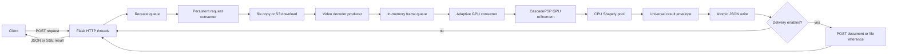

# Service workflow

The service is a persistent single-GPU producer-consumer worker exposed through
Flask and hosted by Gunicorn. It loads the model once, serializes GPU jobs, and
keeps HTTP connections open until each job completes.

## Runtime topology



Gunicorn runs one worker process to avoid loading duplicate model copies into
GPU memory. That process keeps one CaRe-Ego instance and one CascadePSP instance
resident. Its threaded HTTP worker can hold several blocking or streaming
sockets while the internal service processes GPU requests one at a time.

## Startup

1. Gunicorn starts its master process from `gunicorn.conf.py`.
2. The master starts one `gthread` Flask worker.
3. `care_ego.http:create_app()` builds the Flask application.
4. `SegmentationService.start()` validates and loads the CaRe-Ego checkpoint
   and CascadePSP refiner once.
5. A daemon request-consumer thread begins waiting indefinitely on the request
   queue.
6. `/health/ready` returns HTTP 200 when that consumer is alive.

Place `weights/care_ego_best_miou_weights.pth` and
`weights/cascadepsp_v1_0.pth` in the project, then start the production
service:

```bash
uv run --frozen gunicorn -c gunicorn.conf.py
```

The default bind is `0.0.0.0:8080`. Override it with `WAKE_BIND`.

## Request contract

Both segmentation endpoints accept the same JSON object:

```json
{
  "request_id": "job-001",
  "video_uri": "file:///data/input.mp4",
  "output_uri": "file:///data/results",
  "simplify_tolerance": 2.0,
  "min_area": 64,
  "max_frames": null,
  "refinement_mode": "low",
  "config": {
    "inference": {"batch_sizes": [128, 64, 32]},
    "delivery": {"enabled": false}
  }
}
```

An S3-backed AWS or Nebius Object Storage request uses the same contract:

```json
{
  "request_id": "aws-job-001",
  "video_uri": "s3://wake-inference/jobs/aws-job-001/input.mp4",
  "output_uri": "s3://wake-inference/jobs/aws-job-001/results/",
  "max_frames": 10
}
```

The response includes the exact result object URI, such as
`s3://wake-inference/jobs/aws-job-001/results/aws-job-001.json`.

| Field | Required | Default | Meaning |
| --- | --- | --- | --- |
| `video_uri` | yes | — | Input video object as a `file://` or `s3://` URI. |
| `output_uri` | yes | — | Result directory or prefix as a `file://` or `s3://` URI. |
| `request_id` | no | generated UUID | Safe output filename stem and request identity. |
| `simplify_tolerance` | no | `2.0` | Topology-preserving polygon simplification tolerance. |
| `min_area` | no | `64` | Minimum segmentation component area in pixels. |
| `max_frames` | no | all frames | Optional test or workload limit. |
| `refinement_mode` | no | server default | `low` fast/global-only or `medium` global-plus-local refinement. |
| `config` | no | `{}` | Namespaced execution overrides, custom pipeline context, and optional downstream delivery. |

Unknown top-level fields and invalid values return HTTP 400. Numeric strings
and booleans are not accepted as numbers, request IDs are limited to 128 safe
filename characters, and JSON request bodies are limited to 1 MiB by default.
Arbitrary custom
sections inside `config` are allowed and preserved; known sections are
validated and applied. The output file is `<output_uri>/<request_id>.json`.
See [Request configuration and service chaining](request-configuration.md).

## HTTP modes

### Blocking response

`POST /v1/segment` waits indefinitely for the queued job. There is no
application or Gunicorn active-request timeout.

```bash
curl --no-buffer -X POST http://localhost:8080/v1/segment \
  -H 'Content-Type: application/json' \
  -d '{
    "request_id": "job-001",
    "video_uri": "file:///data/input.mp4",
    "output_uri": "file:///data/results"
  }'
```

Successful response:

```json
{
  "request_id": "job-001",
  "output_path": "/data/results/job-001.json",
  "output_uri": "file:///data/results/job-001.json",
  "frame_count": 300,
  "batch_size": 128,
  "elapsed_seconds": 8.42,
  "schema_name": "wake-ai/inference-result",
  "schema_version": "1.0.0",
  "delivery": {
    "enabled": false,
    "status": "disabled",
    "attempts": 0
  }
}
```

### Streaming response

`POST /v1/segment/stream` keeps an SSE connection open. It immediately emits a
`queued` event, emits a `heartbeat` every 15 seconds while waiting, and finishes
with `result` or `error`.

```text
event: queued
data: {"status":"queued"}

event: heartbeat
data: {"status":"processing","pending_requests":1}

event: result
data: {"request_id":"job-001", ...}
```

The heartbeat protects long jobs from infrastructure that closes silent
connections.

## Per-request processing

1. **Validate** — Reject unknown fields, unsafe IDs, unsupported URI schemes,
   and invalid numeric limits.
2. **Resolve input** — Validate the `file://` path or `s3://` bucket and key.
3. **Download** — Copy or download the source into an isolated temporary
   directory using the configured S3-compatible client.
4. **Decode** — A producer thread decodes frames with OpenCV into an unbounded
   in-memory queue.
5. **Batch** — The GPU consumer first tries batches of 128, then 64 and 32.
   Sizes 16, 8, 4, 2, and 1 are safety fallbacks for smaller devices and final
   partial batches.
6. **Infer** — CUDA uses inference mode, automatic mixed precision, TF32,
   cuDNN benchmarking, pinned host memory, and non-blocking transfers.
7. **Refine** — CascadePSP independently refines left/right hand and object
   masks. The worker resolves hand-label competition and rebuilds shared-object
   and contact masks from the refined results.
8. **Post-process** — A CPU thread pool converts masks to simplified Shapely
   polygons, bounding boxes, representative points, and contact points while
   later GPU batches continue.
9. **Normalize** — Predictions are wrapped in the versioned universal result
   format and receive deterministic per-document IDs.
10. **Persist** — Local JSON is flushed and replaced atomically; S3 JSON is
    assembled locally and uploaded to the requested result prefix.
11. **Deliver** — When enabled, POST the full document or file reference to the
    next service using delivery-only retries and an idempotency key.
12. **Respond** — The waiting Future resolves and Flask sends the completion
    metadata through the blocking response or SSE result event.

## Batching and failure recovery

An out-of-memory error does not discard pending frames. The consumer releases
the device cache and retries the same frames with the next smaller batch size.
The largest batch that actually succeeded is reported as `batch_size`.

At the request level, transient `OSError` and `RuntimeError` failures are
attempted three times by default, with exponential delays of one and two
seconds. Missing and undecodable videos fail immediately. A request can
override both values under `config.retry`. A failed request resolves with an
error but does not terminate the persistent consumer, so later queued requests
continue. If inference fails while decoding is still active, the producer is
cancelled and joined before temporary resources are released. Downstream
delivery has its own retry loop and never repeats GPU processing.

The worker retains the last 256 completed inference IDs in memory, including
required-delivery failures after output persistence. An identical submission
reuses that outcome and never reruns inference or delivery. Reusing a cached or
in-flight ID with a different request returns HTTP 400.

If the internal consumer is unexpectedly absent, the Flask layer attempts to
restart it before accepting another job. If the whole Flask worker exits, the
Gunicorn master starts a replacement process and reloads the model.

## Concurrency and throughput

- One copy of each stage and one GPU request consumer prevent duplicate VRAM
  use and conflicting inference streams.
- Video decoding overlaps GPU inference.
- Polygon conversion overlaps subsequent GPU batches.
- Eight HTTP threads are the default, so long-lived sockets can wait without
  blocking health checks or other submissions.
- Requests are FIFO. `pending_requests` in `/health/ready` and SSE heartbeats
  reports the current queue depth.
- Lifecycle transitions are serialized, preventing concurrent HTTP requests
  from starting duplicate request-consumer threads.
- Decode/preprocessing and inference use a bounded producer-consumer queue of
  three batches, so long videos do not accumulate decoded frames in host RAM.

CascadePSP officially targets CUDA and CPU. On Apple systems the upstream
area-resize operation is incompatible with MPS for general frame dimensions,
so this package automatically runs only the refinement stage on CPU while
CaRe-Ego remains on MPS. CUDA deployments keep both stages on GPU.

## Configuration

Application settings are Python constants in
[`care_ego/server_config.py`](../care_ego/server_config.py). Gunicorn settings
are Python values in [`gunicorn.conf.py`](../gunicorn.conf.py).

| Environment variable | Default | Meaning |
| --- | --- | --- |
| `WAKE_CHECKPOINT_PATH` | `weights/care_ego_best_miou_weights.pth` | Tensor-only model checkpoint path. |
| `WAKE_DEVICE` | `auto` | Torch device selection. |
| `WAKE_BIND` | `0.0.0.0:8080` | HTTP bind address. |
| `WAKE_HTTP_THREADS` | `8` | Concurrent Gunicorn HTTP threads. |
| `WAKE_LOG_LEVEL` | `info` | Gunicorn log level. |
| `WAKE_REFINEMENT_MODE` | `low` | Default CascadePSP profile: `low` or `medium`. |
| `WAKE_REQUEST_MAX_BYTES` | `1048576` | Maximum JSON request-body size. |
| `WAKE_S3_ENDPOINT_URL` | AWS SDK default | Optional S3-compatible endpoint, required for Nebius Object Storage. |
| `WAKE_S3_REGION` | `AWS_REGION`, then `AWS_DEFAULT_REGION` | Region used to sign S3-compatible requests. |
| `WAKE_CASCADEPSP_MODEL_DIR` | project-root `weights` | Directory containing `cascadepsp_v1_0.pth`. |
| `WAKE_CASCADEPSP_ALLOW_DOWNLOAD` | `false` when local model exists | Allow verified official-weight download when missing or corrupt. |
| `WAKE_VIDEO_DECODER` | `opencv` | `nvdec` uses FFmpeg/NVDEC with an automatic OpenCV fallback. |
| `WAKE_CUDA_GRAPH_BATCH_SIZE` | `0` | Fixed CUDA Graph batch; near-full tail batches are padded, while smaller OOM fallbacks run eagerly. |

## Operational endpoints

| Method and path | Purpose |
| --- | --- |
| `GET /health/live` | Confirms the Flask process is alive. |
| `GET /health/ready` | Confirms the internal consumer is running. |
| `GET /v1/schema` | Returns the universal result JSON Schema. |
| `POST /v1/segment` | Blocking segmentation request. |
| `POST /v1/segment/stream` | Segmentation request with SSE heartbeat. |

## Docker deployment

`Dockerfile` is a multi-stage locked build. Its runtime properties are:

- Python 3.10 and dependencies installed from `uv.lock` with `--frozen`.
- No development dependencies, media, outputs, or training checkpoints in the
  final image. The two runtime inference checkpoints are embedded read-only.
- A single Gunicorn process with the existing Python configuration.
- Non-root UID/GID 10001 and Tini as PID 1.
- `WAKE_DEVICE=cuda` and project weight filenames configured by default.
- `/health/ready` as the Docker health check, with a 120-second startup grace
  period for model loading.

Build the NVIDIA production architecture:

```bash
docker build --platform linux/amd64 \
  --tag wake_hands_segmentation_worker:0.1.0 .
```

Run the self-contained service (no configuration or weight mount required):

```bash
docker run --detach \
  --name wake_hands_segmentation_worker \
  --restart unless-stopped \
  --gpus all \
  --publish 8080:8080 \
  wake_hands_segmentation_worker:0.1.0
```

GPU access and host port publication are Docker host permissions and cannot be
declared by the image. With an NVIDIA default runtime and no need for host port
publication, `docker run wake_hands_segmentation_worker:0.1.0`
starts the service directly.

For `file://` jobs, input and output paths are container paths. Mount storage
only when the job must read or persist host files; the mounted writable
directory must permit writes by container UID 10001:

```json
{
  "request_id": "docker-job-001",
  "video_uri": "file:///data/videos/input.mp4",
  "output_uri": "file:///data/results"
}
```

S3-backed jobs need no data mount. On AWS, the runtime identity needs
`s3:GetObject` for input keys and `s3:PutObject` for result keys, and credentials
come from the standard AWS credential chain. On Nebius, set
`WAKE_S3_ENDPOINT_URL` to the regional Object Storage endpoint and provide a
Nebius access key through the deployment secret channel. Credentials must not
be embedded in the image or request.

The exact same image and request schema run on both clouds:

- AWS deployment assets: [`deploy/aws`](../deploy/aws)
- Nebius deployment assets: [`deploy/nebius`](../deploy/nebius)

Useful checks:

```bash
docker inspect --format '{{.State.Health.Status}}' \
  wake_hands_segmentation_worker
curl --fail http://127.0.0.1:8080/health/ready
curl --fail http://127.0.0.1:8080/v1/schema
```

Linux/x86-64 resolves the CUDA-enabled PyTorch wheel and its CUDA 12.1
libraries. Linux/ARM64 resolves the CPU PyTorch wheel and is suitable only for
container packaging and slow functional tests unless a platform-specific CUDA
PyTorch distribution is substituted. Apple MPS is not exposed inside Docker.
